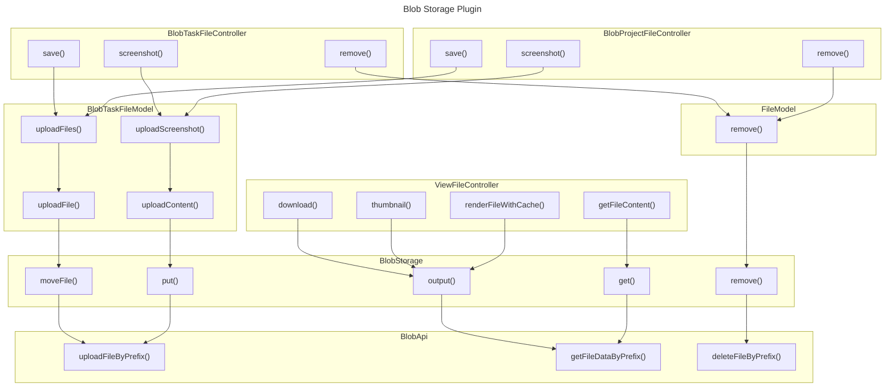

# Blob Object Storage Plugin
==========================

This plugin stores uploaded files using Relay-Blob Bundle instead of using the local filesystem.

## Relay-Blob Bundle
https://github.com/digital-blueprint/relay-blob-bundle

## DbpRelayBlobLibrary
https://github.com/digital-blueprint/relay-blob-library

## Installation
You have the choice between 3 methods:

Install the plugin from the Kanboard plugin manager in one click
Download the zip file and decompress everything under the directory plugins/BlobStorage
Clone this repository into the folder plugins/BlobStorage

Note: Plugin folder is case-sensitive.

## Configuration
You can configure this plugin through the user interface or with the config file

### With the user interface
Go to Settings > Integrations >  Blob File Storage


### With the config file

Add those config parameters in your `config.php`:

```php
define('BLOB_KEY', '12345678901234567890123456789012345678901234567890123456789012');
define('BLOB_API_HOST', 'https://blog-api-host.com/');
define('BLOB_BUCKET_ID', '0000');
```

### Requirements
------------
- PHP >= 5.6
- Kanboard >= 1.2.1

